# Rapport du Projet Chatbot ISET
## Projet de Machine Learning - DSIR 1
### Année Universitaire 2024/2025


## Table des Matières
1. [Introduction](#1-introduction)
2. [État de l'Art](#2-état-de-lart)
3. [Architecture du Système](#3-architecture-du-système)
4. [Implémentation Technique](#4-implémentation-technique)
5. [Fonctionnalités Innovantes](#5-fonctionnalités-innovantes)
6. [Évaluation et Résultats](#6-évaluation-et-résultats)
7. [Conclusion et Perspectives](#7-conclusion-et-perspectives)
8. [Annexes](#8-annexes)

## 1. Introduction

### 1.1 Contexte
Le projet de chatbot ISET s'inscrit dans le cadre du cours de Machine Learning de la formation DSIR 1. L'objectif est de développer un assistant virtuel capable de guider les utilisateurs du site web de l'ISET en répondant à leurs questions et en les orientant vers les pages pertinentes.

### 1.2 Objectifs
- Développer un chatbot intelligent pour le site de l'ISET
- Répondre aux questions des étudiants sur divers sujets
- Optimiser la navigation des utilisateurs
- Implémenter des techniques de NLP et de Machine Learning

### 1.3 Problématique
La principale problématique est de créer un système capable de :
- Comprendre les questions en langage naturel
- Fournir des réponses pertinentes
- Guider les utilisateurs vers les bonnes pages
- S'adapter aux différentes formulations des questions

## 2. État de l'Art

### 2.1 Approches Existentes
1. **Chatbots basés sur des règles**
   - Avantages : Simple, prévisible
   - Inconvénients : Rigide, maintenance coûteuse

2. **Chatbots basés sur le Machine Learning**
   - Avantages : Flexible, adaptable
   - Inconvénients : Nécessite des données d'entraînement

3. **Chatbots hybrides**
   - Avantages : Combine les forces des deux approches
   - Inconvénients : Plus complexe à maintenir

### 2.2 Techniques de NLP
1. **Prétraitement du texte**
   - Tokenization
   - Suppression des stopwords
   - Stemming/Lemmatisation

2. **Représentation vectorielle**
   - TF-IDF
   - Word Embeddings
   - Bag of Words

3. **Modèles de classification**
   - K-Nearest Neighbors
   - Support Vector Machines
   - Naive Bayes

## 3. Architecture du Système

### 3.1 Vue d'Ensemble

```mermaid
graph TD
    A[Interface Utilisateur] --> B[API Flask]
    B --> C[Prétraitement]
    C --> D[Modèle ML]
    D --> E[Base de Données]
    B --> A
```


### 3.2 Composants Principaux
1. **Module de Prétraitement**
   - Nettoyage du texte
   - Tokenization
   - Gestion des stopwords
   - Stemming

2. **Module de Machine Learning**
   - Vectorisation TF-IDF
   - Classification KNN/SVM
   - Calcul de confiance

3. **API Flask**
   - Gestion des requêtes
   - Prétraitement
   - Prédiction
   - Réponses

4. **Interface Streamlit**
   - Interface utilisateur
   - Gestion des conversations
   - Affichage des résultats

## 4. Implémentation Technique

### 4.1 Prétraitement des Données
```python
class TextProcessor:
    def __init__(self, language: str = 'french'):
        self.language = language
        self.stemmer = SnowballStemmer(language)
        self.stop_words = set(stopwords.words(language))

    def process(self, text: str) -> List[str]:
        cleaned_text = self.clean_text(text)
        tokens = self.tokenize(cleaned_text)
        tokens = self.remove_stopwords(tokens)
        tokens = self.stem(tokens)
        return tokens
```

### 4.2 Modèles de Machine Learning
```python
class ChatbotModel:
    def __init__(self, model_type: str = 'knn'):
        self.vectorizer = TfidfVectorizer(
            max_features=5000,
            ngram_range=(1, 2)
        )
        
        if model_type == 'knn':
            self.model = KNeighborsClassifier(
                n_neighbors=5,
                weights='distance'
            )
        else:
            self.model = SVC(
                kernel='linear',
                probability=True
            )
```

### 4.3 Interface Utilisateur
```python
# Configuration de la page Streamlit
st.set_page_config(
    page_title="ISET Chatbot",
    page_icon="🤖",
    layout="wide"
)

# Style CSS personnalisé
st.markdown("""
<style>
    .chat-message {
        padding: 1.5rem;
        border-radius: 0.5rem;
        margin-bottom: 1rem;
    }
</style>
""")
```

## 5. Fonctionnalités Innovantes

### 5.1 Système de Confiance
- Calcul du score de confiance pour chaque réponse
- Affichage visuel du niveau de confiance
- Gestion des cas de faible confiance

### 5.2 Suggestions Proactives
- Analyse du contexte de la conversation
- Proposition de questions connexes
- Liens vers des pages pertinentes

### 5.3 Gestion Multilingue
- Support du français et de l'anglais
- Détection automatique de la langue
- Prétraitement adapté à chaque langue

## 6. Évaluation et Résultats

### 6.1 Métriques d'Évaluation
- Précision des réponses
- Temps de réponse
- Satisfaction utilisateur
- Taux de résolution

### 6.2 Résultats des Tests


### 6.3 Analyse des Performances
- Comparaison des modèles
- Points forts et faibles
- Améliorations possibles

## 7. Conclusion et Perspectives

### 7.1 Bilan du Projet
- Objectifs atteints
- Challenges rencontrés
- Solutions apportées

### 7.2 Limites Actuelles
- Taille du dataset
- Complexité des questions
- Gestion des cas particuliers

### 7.3 Améliorations Futures
- Enrichissement du dataset
- Ajout de nouvelles fonctionnalités
- Optimisation des performances

## 8. Annexes

### 8.1 Structure du Projet
```
iset-chatbot/
├── data/                   # Données d'entraînement
├── models/                 # Modèles entraînés
├── src/
│   ├── preprocessing/      # Prétraitement
│   ├── models/            # Modèles ML
│   ├── api/               # API Flask
│   └── utils/             # Utilitaires
├── tests/                 # Tests
├── web/                   # Interface
└── config/               # Configuration
```

### 8.2 Exemples de Questions/Réponses
1. **Question**: "Quels sont les horaires des cours ?"
   **Réponse**: "Les horaires des cours sont disponibles sur le portail étudiant. Vous pouvez les consulter en vous connectant avec votre identifiant."

2. **Question**: "Comment s'inscrire aux examens ?"
   **Réponse**: "L'inscription aux examens se fait via le portail étudiant. Vous devez vous connecter et suivre la procédure d'inscription dans la section 'Examens'."

### 8.3 Captures d'Écran
[Insérer des captures d'écran de l'interface]

### 8.4 Documentation Technique
- Installation
- Configuration
- Utilisation
- Maintenance

---

*Réalisé par : [Votre Nom]*
*Date : [Date]*
*Version : 1.0* 